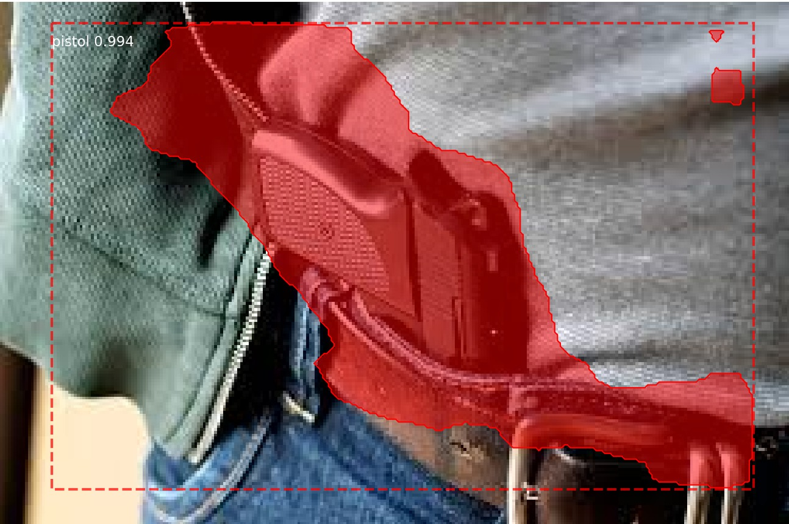

# Pistol Detection with Mask R-CNN

By : MOUAD HOUARI & MOHAMED LOULIDI BENTATA

## Project Overview

In this project, we set up a model to recognize pistols in images using the Mask R-CNN framework. Our objective was to build a custom object detector capable of accurately identifying pistols in various environments. Here’s a summary of our approach:

- **Dataset**: We built a dataset of over 150 images containing pistols in diverse scenarios, labeling each image to provide clear examples for the model to learn from.
- **Environment**: We prepared the Mask R-CNN environment, downloaded the pre-trained COCO model, and fine-tuned it specifically for pistol detection by retraining the head layers, which focus on recognizing new object categories.

This repository includes our training log, sample images, results, hyperparameters, and a detailed analysis of the model's performance.

## 1. Training Log
Here are the screenshots of the terminal showing the training log for each epoch of the model's training process:

  


Now, let's analyze the last training epoch in detail. Below is the final line from our training log, which captures the different types of losses after the last epoch:
```
- 2342s 23s/step - loss: 0.2161 - rpn_class_loss: 0.0024 - rpn_bbox_loss: 0.0686 - mrcnn_class_loss: 0.0136 - mrcnn_bbox_loss: 0.0310 - mrcnn_mask_loss: 0.1005 - val_loss: 0.5975 - val_rpn_class_loss: 0.0041 - val_rpn_bbox_loss: 0.2150 - val_mrcnn_class_loss: 0.0284 - val_mrcnn_bbox_loss: 0.1646 - val_mrcnn_mask_loss: 0.1854**
```

The final log line provides an overview of the model's performance during both training and validation phases:

- **Training Loss**: The model's total loss is **0.2161**, which indicates how well it has learned to minimize errors across all components.
- **RPN Class Loss**: The **0.0024** value shows the loss for the Region Proposal Network (RPN) class predictions, which is very small, suggesting good performance.
- **RPN Bounding Box Loss**: The **0.0686** value indicates how well the bounding boxes are predicted by the RPN.
- **Mask Losses**: The **0.1005** mask loss suggests the accuracy of pixel-wise segmentation predictions, showing room for improvement in fine-grained details.
- **Validation Loss**: The **val_loss** of **0.5975** is higher than the training loss, which is common and suggests some overfitting to the training data. The goal is to reduce this gap over time.

In general, the model seems to have learned well, though further tuning could help improve the validation performance, especially for the mask and bounding box losses.

## 2. Dataset Samples and Results

Here are some examples from our training and validation datasets, as well as a few test images to demonstrate how the model performs on unseen images.

- **Training and Validation Examples**: 

 

In the following images, we show examples of the annotated data used to train the model. Using VGG Image Annotator, we labeled each instance of the target object, ensuring accurate bounding boxes and segmentation masks. These annotations were essential for teaching the model to detect the object boundaries precisely.

- **Test Results**: 

  

The images below illustrate the model's performance on test images. You can see how well the model has learned to identify the object (pistol) in various scenarios. The bounding boxes and masks highlight the areas detected by the model, and overall, the results indicate the effectiveness of the training process on unseen data.

## 3. Confusion Matrix

The confusion matrix provides insights into the model's accuracy by illustrating true positives, false positives, false negatives, and other relevant metrics.


This confusion matrix shows the model's performance in distinguishing between the classes. The model successfully identified 32 instances of the positive class (1) but misclassified 3 instances of the negative class (0) as positive. 

This demonstrates a strong ability to recognize the positive class, and with additional training data, more epochs, and possibly fine-tuning, we expect to see even fewer false positives as the model continues to improve its understanding of each class.


## 4. Training and Validation Loss Graph

The graph below illustrates the model’s loss over the training and validation phases. By monitoring these losses, we assessed how well the model adapted during training.


This graph shows how the training and validation loss change as the model trains. We can see that the training loss consistently goes down, which means the model is learning and improving on the training data. The validation loss drops at first but then levels off and varies slightly. 

These small changes in validation loss suggest that the model might be nearing its limit in terms of generalizing well with the current data and setup. However, with more data or adjustments to the model, we could see more stable validation loss and better overall performance.

## 5. Hyperparameters

We experimented with various hyperparameters to achieve the best results. Here are the final settings we used:

- **Activation Function**: For the activation function, we chose ReLU due to its simplicity and efficiency. ReLU not only speeds up training by setting negative values to zero but also introduces sparsity, which can help the network focus on important features. Additionally, ReLU avoids the vanishing gradient problem, enabling faster convergence and making it effective for learning complex patterns, which is essential in tasks like object detection.

- **Learning Rate**: We set the learning rate to **0.001**, a standard choice that balances steady learning with risk of divergence. 
- **Optimizer**: We initially experimented with the Adam optimizer, anticipating that its adaptive learning rate might help the model converge faster given our relatively small dataset. However, we encountered overfitting issues, as Adam seemed to adapt too closely to the training data, possibly due to the dataset’s limited variety. To address this, we switched to SGD (Stochastic Gradient Descent), which provided a steadier, more generalized learning process. With SGD, we observed better generalization on validation data, as it helped prevent the model from fitting too closely to the training data patterns.

- **Epochs**:  We trained the model for **20 epochs**, aiming to balance between sufficient learning and computational efficiency. This choice allowed the model to capture key features without overfitting on the relatively small dataset.


Testing multiple hyperparameter configurations allowed us to optimize the model's performance.

## 6. Comments on Results

We observed that the model achieved accurate detection for pistols across a range of images. However, there were a few areas that could benefit from further training, such as the model occasionally confusing the object pistol with other objects. As a solution, we could add recognition for those specific objects and include them in the training set. This additional training would help the model better distinguish between these objects and a pistol, improving accuracy and reducing misclassifications.

Overall, the model demonstrated solid accuracy in identifying pistols, and further refinements could improve its reliability even more.

---

Thank you for reviewing our project. This repository includes all necessary files to reproduce our results.


